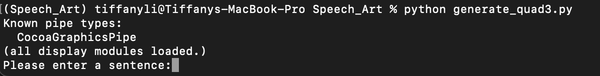
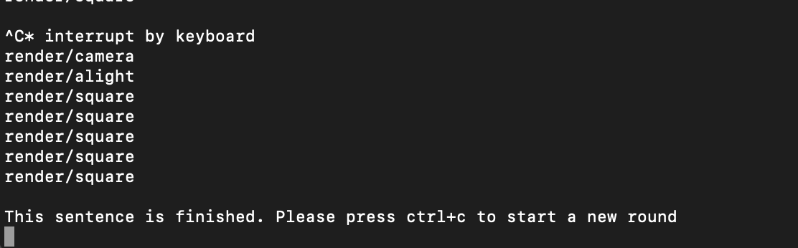

## Speech_Art Version 6
Update 2022/08/23

### Installation

First, you need to get the latest version of the code using the following command
```
git pull
```
Then, activate the virtual environment as we did before
```
conda activate Speech_Art
```
Then, run the following command to install new libraries
```
pip install -r requirements.txt
```
If there shows errors about tensorflow installation because of the M1 chip, please refer to this [article](https://caffeinedev.medium.com/how-to-install-tensorflow-on-m1-mac-8e9b91d93706)

Install NLTK library
```
python install_nltk_file.py
```
Then, run the following command to run the program
```
python generate_quad6.py
```
### Working with the program

When it shows "You can say something" on the screen, you nca start speaking. When your sentence is finished, there will generate structures autometically. You don't need to press "R" to render the next framework.


## Speech_Art Version 5
Update 2022/08/11

First, you need to get the latest version of the code using the following focusInCommand
```
git pull
```
Then, activate the virtual environment as we did before
```
conda activate Speech_Art
```
Then, run the following command to install new libraries
```
pip install -r requirements.txt
```
Then, run the following command
```
conda install -c huggingface transformers
```
Then, run the following command to run the program
```
python generate_quad5.py
```
There might be some error because of the MAC OS system.

### Algorithm Rules
#### Current language features:
##### Document-Based:
- Co-reference: Build connections between different cluster (transformer)
- Document Sentiment: Control the AmbientLight
##### Sentence-Based:
- Parts of Speech: Decide frameworks’ color
- Sentence Vector (Bert): Decide clusters’ starting position
- Sentence Sentiment: Decide clusters’ color (V)
- CFG-Grammer Analysis: Decide frameworks’ dimension
##### Word-Based:
- Word Vector: Decide frameworks’ coordinates
- Syllables Analysis: Decide colors inside frameworks
- Word length: Decide # of surfaces inside frameworks
(Keyword adding)

#### Other Features:
- GAN to generate surfaces inside frameworks (working)
- Shadow
- Moving Camera
- Text Input Box
- Adding Dialog
- Changes on the existing clusters


## Speech_Art Version 2
Update 2022/07/29

### Update Instruction

First, you need to get the latest version of the code using the following focusInCommand
```
git pull
```
There might be errors because of the github setting but I'm not sure what the errors will be... Feel free to contact me when errors raise.

Then, activate the virtual environment as we did before
```
conda activate Speech_Art
```

Then, run the following command to install new libraries
```
pip install -r requirements.txt
```

Then, run the code using the following focusInCommand
```
python generate_quad3.py
```

In this version, the sentence is input through terminal. Type in the sentence after "Please enter a sentence:" after seeing this



You will see updates on the pop-up window. Now only the first surface is shown on the screen. To see the next word, type "ctrl+c" in the terminal (I will update this soon.)

When you see the following message "This sentence is finished. Please press ctrl+c to start a new round", you need to press ctrl+c to enter a new sentence. Type in the sentence after "Please enter a sentence:"



This is just a demo to evaluate, not the final interaction model.

### Algorithm Rules
The 3D structures are generated based on the analytical results of the input sentence.
- One 3D structure = one sentence.
- One quad in one 3D structure = one word.
- For each sentence, first generate #number of words in the sentence pairs of coordinates based one the sentence vector and word-vectors. Each pair of coordinates represents one word.
- Then given the (2*number of words in the sentence) coordinates, generate the Voronoi diagams and obtain all vertices. Keep the vertices that are closer to the structure center.
- For each word, select 2 vertices. Compute the third vertex based one the first vertex, the word length and the word sentence. The forth vertex is controlled by the 1st, 2nd and 3rd.
- The color of each quad (word) is decided by the word vector. The H & S value is the first 2 elements of the 3-D vector. The V value is the sentiment score of the sentence. The A value is the third element of the 3D vector.


## Speech_Art Version
Update 2022/07/22

### Installation Instruction

Open the terminal to set up the virtual environment
```
conda create -n Speech_Art python=3.9
conda activate Speech_Art
```
Download the folder from github in your working path and cd to the folder
```
git clone https://github.com/tiffanylyx/Speech_Art.git
cd Speech_Art
```
Download all the models from the link https://drive.google.com/drive/folders/1EN_I-4xatD9rBqwbXmBfqHMoQjNW5nbv?usp=sharing.
Move all the models in the folder "Speech_Art/model".

Install all the dependencies
```
pip install -r requirements.txt
```
Install NLTK library
```
python install_nltk_file.py
```
Run the program
```
python generate_quad2.py
```
There will be a text input UI on the right-bottom corner of the window. Type in a sentence without special notions or numbers. Hit enter to see the result.


You might need to adjust the camera in the program to explore the generated 3D structure.

- Use the Right Mouse Button to zoom in and out.
- Use the Middle Mouse Button to rotate.
- Use the Left Mouse Button to pan.

### When you run the codes
To keep the program updated, run
```
git pull
```
Then to activate the virtual environment
```
conda activate Speech_Art
```


### Algorithm Rules
The 3D structures are generated based on the analytical results of the input sentence.
- One 3D structure = one sentence.
- One quad in one 3D structure = one word.
- Each structure represents one sentence. Each quad in the structure represents one word.
- The position of each 3D structure is decided by the sentence vector.
- The distance between the previous and the current structures represent the time period between the two input time
- Quads within one structure spread along the sentence vector.
- Two edges of the quad are decided by the word vectors. Then another two edges are connected to form a quad.
- The color of each quad (word) is decided by the word vector.
