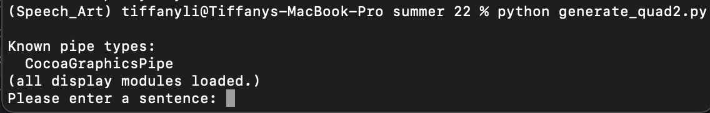

## Speech_Art Version 1.0
2022/07/20

Open the terminal to set up the virtual environment
```
conda create -n Speech_Art python=3.9
conda activate Speech_Art
```
Download the folder and cd to the folder path
```
cd $folder_path
```
Install all the dependencies
```
pip install -r requirements.txt
```
Run the program
```
python generate_quad2.py
```
Enter a sentence to the program when the program shows this, and then hit "enter"

eg: the idea is to see how a set of grammar rules can be used to design form in space



```
Please enter a sentence: Enter the sentence here
```
You might need to adjust the camera in the program to explore the generated 3D structure.
- Use the Right Mouse Button to zoom in and out.
- Use the Middle Mouse Button to rotate.
- Use the Left Mouse Button to pan.
